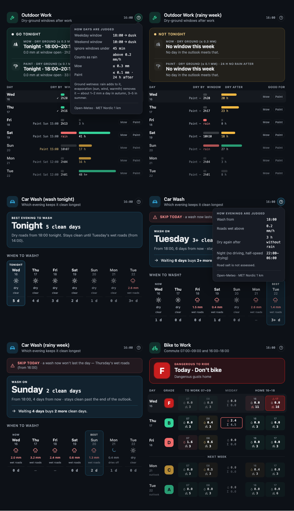

# Outdoor Work Card

A self-contained Home Assistant Lovelace card that answers two questions a homeowner in a rainy climate keeps asking:

- **Outdoor work** — _When is the ground dry enough to mow, and is there a dry stretch on both sides for painting?_
  Every day of the outlook is shown as a **dry runway → after-work window → dry runway**, with a pill per activity saying whether that evening qualifies.
- **Car wash** — _Which evening should I wash the car so it stays clean longest?_
  Each evening shows how many clean days would follow, with light drizzle and overnight rain treated as harmless and heavier daytime rain ending the streak.



No sensors, helpers, automations or template YAML to set up. The card fetches its own data from **Open-Meteo** (default model: **MET Nordic 1 km**, the same model behind Yr), including the last three days of precipitation, so it knows how long the ground has been drying **without a rain gauge**.

## Install

### HACS (custom repository)

1. HACS → _Frontend_ → ⋮ → **Custom repositories** → add this repo URL, category **Dashboard** (Lovelace).
2. Install **Outdoor Work Card** and reload the browser when prompted. HACS registers the resource for you.

### Manual

Copy `dist/outdoor-work-card.js` to `config/www/outdoor-work-card.js` and add a dashboard resource:

```yaml
url: /local/outdoor-work-card.js
type: module
```

## Use

Add the card from the dashboard editor (search _Outdoor Work_). The visual editor covers everything except custom activities; minimal YAML:

```yaml
type: custom:outdoor-work-card
mode: work # or: carwash, commute
```

Location defaults to your Home Assistant home coordinates and times are evaluated in your HA time zone.

The rules the card applies (windows, thresholds, dry runways) live behind the `?` button in the card header, generated from your config so they always match the logic.

### Outdoor-work mode

```yaml
type: custom:outdoor-work-card
mode: work
weekday_start: "18:00" # window opens Mon–Fri
weekend_start: "10:00" # window opens Sat/Sun
window_end: dusk # dusk | sunset | "HH:MM"
min_window_minutes: 45 # shorter evenings are shown but never recommended
rain_threshold: 0.2 # mm/h that counts as "rain" for the ground
tasks: # optional; these are the defaults
  - name: Mow
    before: 24 # hours of dry ground required before the window
  - name: Paint
    before: 24
    after: 24 # …and hours it must stay dry afterwards
```

Up to four tasks. Only `before` is required; add `after` for anything that needs to cure. Examples: `- name: Stain deck, before: 48, after: 12` · `- name: Weed, before: 6`.

How a day is judged:

- **Window** = start time → civil dusk (or sunset / fixed time), clamped to "now" for today. Rain inside the window disqualifies it (shown red).
- **Dry before** = hours since the last hour with more than `rain_threshold` mm before the window opens. Bars turn green when a task's requirement is met, amber at half, grey below. Capped at 48 h for display.
- **Dry after** = hours from the window closing until the next such hour.
- The hero names the **next** qualifying evening per task and, if a later day offers more daylight, the **longest** one.

### Car-wash mode

```yaml
type: custom:outdoor-work-card
mode: carwash
wash_start: "18:00"
ok_rain: 0.5 # mm/h harmless to a clean car in daytime
night_max: 4 # mm/h tolerated overnight
night_from: "22:00"
night_until: "06:00"
dry_roads_hours: 2 # no heavy rain this long before the wash (wet roads)
```

Each column's bottom number is the clean days you'd get by washing **that** evening. The streak from an evening counts that day and every following day whose rain stays under the thresholds; `4+` means it runs past the end of the outlook. The hero picks the longest streak (earliest on ties) and adapts to one of three states. When **tonight is the pick**, it reads "Best evening to wash → Tonight" with the clean-days count and what eventually ends the streak. When a **later evening wins**, a red "Skip today" banner says why tonight falls short, the hero recommends the better day, and a trade-off line spells out how many extra clean days waiting buys. When **no evening survives the outlook**, it shows "Outlook → nothing stays clean" and why.

### Commute mode

```yaml
type: custom:outdoor-work-card
mode: commute
to_work_start: "07:00"
to_work_end: "09:00"
home_start: "16:00"
home_end: "18:00"
midday_start: "09:00" # midday window: flag only, never changes the grade
midday_end: "15:00"
rain_fine: 0.2 # mm/h still fine / still tolerable
rain_ok: 0.8
wind_fine: 6 # effective wind, m/s
wind_ok: 10
workdays: [1, 2, 3, 4, 5] # ISO weekdays
```

Every commute hour gets a rain and a wind level: fine, tolerable, bad or **dangerous**. Wind is the **effective wind** — the 10 m mean, or 60% of the gust speed when gusts are unusually strong for the mean. In steady wind it equals the mean; `wind_fine` / `wind_ok` compare against it. Tap or hover a tile to see rain, effective, mean and gust values.

An hour is dangerous when rain is above 8 mm/h or effective wind is above 14 m/s (≈ gusts above 23 m/s), whatever your thresholds are.

Day grade, from the two commutes only (each judged by its worst hour):

| Grade | Meaning                     |
| ----- | --------------------------- |
| A     | both commutes fine          |
| B     | one commute tolerable       |
| C     | both commutes tolerable     |
| D     | one commute bad             |
| E     | both commutes bad           |
| F     | a commute hour is dangerous |

The midday column shows peak and total rain. On A–C days it gets a red outline — and the reason line says "consider home office" — when one midday hour is above `rain_ok` or the midday total is above 3 × `rain_ok`, since rain may drift into a commute.

The editor's **Rider type** picker fills the four thresholds; you can then fine-tune them. Config stores only the four numbers:

| Preset             | `rain_fine` | `rain_ok` | `wind_fine` | `wind_ok` |
| ------------------ | ----------- | --------- | ----------- | --------- |
| Fair-weather       | 0.1         | 0.3       | 5           | 8         |
| Everyday (default) | 0.2         | 0.8       | 6           | 10        |
| All-weather        | 0.5         | 2.0       | 8           | 12        |

Values are 10 m model winds; don't correct them to rider height. Snow and ice are not assessed yet.

> Upgrading: `rain_ok` now defaults to 0.8 (was 1.0), `wind_*` compare against effective wind, midday no longer changes the grade, and there's a new F grade.

### Common options

| Option                  | Default          | Notes                                                        |
| ----------------------- | ---------------- | ------------------------------------------------------------ |
| `title`, `subtitle`     | per mode         | Header text                                                  |
| `days`                  | `7`              | 3–10                                                         |
| `refresh_minutes`       | `60`             | Open-Meteo updates hourly; no point going lower              |
| `latitude`, `longitude` | HA home          | Override for a cabin, etc.                                   |
| `model`                 | `metno_seamless` | `best_match` outside the Nordics, or any Open-Meteo model id |
| `accent`                | green / blue     | Any CSS colour                                               |

## Data source, honestly

- **Open-Meteo** is free for non-commercial use, needs no key, and allows browser (CORS) requests. One request per card location per hour; all cards on a page share it.
- `metno_seamless` = MET Nordic (1 km, Norway/Sweden/Denmark/Finland) for the first ~2.5 days, then ECMWF. Days beyond ~60 h are drawn slightly dimmer: the hour-by-hour detail there is a model blend, not the high-resolution short-range forecast.
- **Rain history** comes from the model's archived analyses (`past_days=3`), not a gauge. For "has the lawn had a day to dry" this is good; for "did it drizzle at my house at 14:00" it is an estimate. If you have a rain gauge, that is still the better source for the _before_ side — a future option could read one.
- Sunset and civil dusk are computed in the card for every day (standard sunrise equation, ±2–3 min).

Why not call `api.met.no` directly? MET asks browser clients to identify themselves via `User-Agent`, which browsers cannot set, and recommends a proxy instead — Open-Meteo serves the same MET Nordic data with browser-friendly terms.

## Develop

```bash
npm install
npm run build          # → dist/outdoor-work-card.js
npm test               # logic tests (node:test) — run `npx rollup -c rollup.test.config.mjs` first
node test/shoot.mjs    # renders test/harness.html with mocked weather → test/shot-*.png
```

`src/logic.ts` is pure and has no DOM dependency — the planning rules live there. `src/outdoor-work-card.ts` renders; `src/editor.ts` is the `ha-form` based visual editor.

## Licence

MIT
